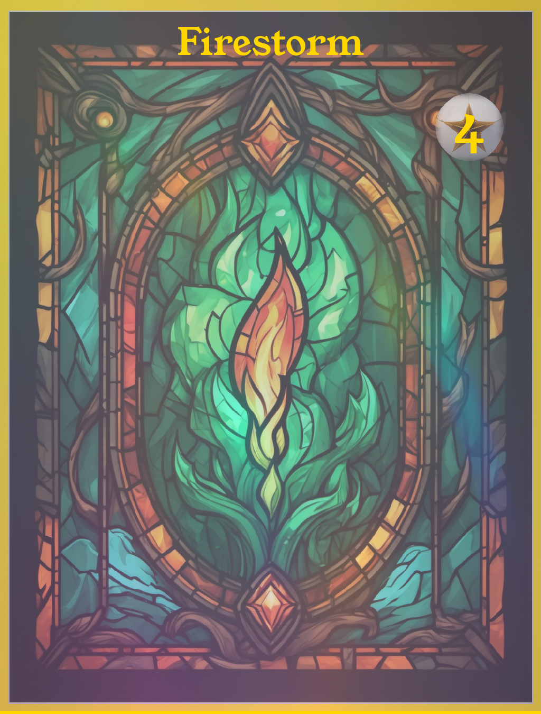

# Elemental Clash - 奇幻生物对决

## 项目介绍

Elemental Clash 是一款令人兴奋的元素主题卡牌对战游戏。在这个奇幻的世界里，玩家将扮演元素法师，运用各种元素的力量来击败对手。游戏融合了策略、运气和技巧，为玩家提供了独特而有趣的游戏体验。

## 背景故事

在一个被元素力量主宰的世界里，四大元素学院培养着最优秀的元素法师。每年，这些学院都会举办一场盛大的 Elemental Clash 锦标赛，来决定谁是最强大的元素掌控者。作为一名有抱负的年轻法师，你将踏上成为元素大师的征程。

## 游戏规则
1. 游戏准备
    - 每位玩家准备一副30张卡片的卡组，包括生物卡和技能卡
    - 双方各抽5张卡作为起始手牌
    - 通过猜拳或掷骰子决定先手玩家
    - 每位玩家起始生命值为20点

2. 卡片类型
    - 生物卡：具有ATK（攻击力）、DEF（防御力）和HP（生命值）属性
    - 技能卡：具有各种特殊效果
    - 卡片稀有度：普通（白色边框）、稀有（银色边框）、罕见（金色边框）、传说（彩虹色全息边框）

3. 回合流程
   a. 抽卡阶段：抽一张卡（首回合除外）
   b. 资源获取：
    - 能量获取：获得与当前回合数相等的能量点
    - 行动点获取：获得2个行动点，加上从上回合保留的行动点（如果有）
      c. 主要阶段：可以进行以下行动
    - 召唤生物：支付等同于生物Level的能量点
    - 使用技能卡：支付卡片标注的能量点，发动技能效果
      d. 战斗阶段：选择攻击者和防守目标，结算伤害
      e. 结束阶段：结算回合末效果，弃牌至手牌上限（默认7张），决定是否保留未使用的行动点（最多1点）

4. 行动点系统
    - 每回合获得2个行动点，用于执行攻击或使用技能
    - 攻击或使用技能各消耗1个行动点
    - 未使用的行动点最多可保留1点到下个回合
    - 行动点最大累积上限为3点
    - 每回合最多使用3个行动点

5. 战斗机制
    - 攻击时，如果攻击者ATK > 防守者DEF，差值即为造成的伤害
    - 如果攻击者ATK ≤ 防守者DEF，造成1点最小伤害
    - 伤害直接从生物的HP中扣除
    - 生物HP降到0或以下时立即被摧毁并移至弃牌堆
    - 生物HP不会在回合结束时自动恢复，需要通过特定卡牌或技能恢复

6. 生物特性
    - 召唤后的生物有"召唤病"，需要等待一回合才能发动攻击
    - 每个生物每回合只能攻击一次
    - 某些生物拥有特殊能力，可以在特定时机触发

7. 升级系统
    - 部分生物卡可以通过满足特定条件升级
    - 升级后，生物的ATK、DEF、HP和特殊能力都会得到强化
    - 升级条件会在卡片上注明

8. 构筑规则
    - 卡组必须包含30张卡片
    - 同名卡在卡组中最多可以包含3张（传说卡片限1张）
    - 卡组中生物卡和技能卡的比例没有严格限制，但建议保持平衡

9. 胜利条件
    - 将对手的生命值减少到0或以下
    - 对手无法在抽卡阶段抽卡（卡组耗尽）

10. 特殊规则
    - 某些强力技能可能需要消耗2个行动点
    - 特殊效果可能提供额外的行动点或能量点
    - 部分卡牌可能与行动点累积机制产生互动

## 策略要点:
1. 卡组构筑：根据策略偏好，平衡生物卡和技能卡的数量，建立特色卡组
2. 资源管理：合理分配能量点和行动点，在召唤生物、使用技能和攻击间找到平衡
3. 场面控制：通过生物的战略性放置和技能卡的巧妙运用，控制场上局势
4. 节奏把握：判断何时积极进攻，何时保守防守，何时累积资源为大行动做准备
5. 卡片协同：挖掘不同卡片之间的配合效果，形成强大的连锁反应
6. 生命值管理：权衡是否用受伤生物继续战斗或保护重要生物
7. 行动点规划：考虑是立即使用行动点还是累积到下回合进行更强力的组合
8. 预判对策：推测对手可能的行动，提前做好应对准备

## 卡牌详情
### 生物卡

1. 盾牌战士 (Shield Warrior)
- 类型：生物 (Creature)
- 费用：2
- ATK: 1 | HP: 4 | DEF: 4
- 技能：嘲讽 - 对手的生物必须优先攻击该生物。
- Skill: Taunt - Enemy creatures must attack this creature first.

2. 岩石傀儡 (Rock Golem)
- 类型：生物 (Creature)
- 费用：2
- ATK: 2 | HP: 4 | DEF: 2
- 技能：坚固 - 受到的伤害减少1点。
- Skill: Sturdy - Takes 1 less damage from all sources.

3. 森林精灵 (Forest Elf)
- 类型：生物 (Creature)
- 费用：2
- ATK: 2 | HP: 3 | DEF: 1
- 技能：敏捷 - 可以在召唤的回合立即攻击。 
- Skill: Haste - Can attack immediately when summoned.

4. 勇敢的见习骑士 (Brave Squire)
- 类型：生物 (Creature)
- 费用：1
- ATK: 1 | HP: 2 | DEF: 1
- 技能：激励 - 你的其他生物获得+1攻击力。
- Skill: Inspire - Your other creatures get +1 attack.

 

5. 魔法学徒 (Magic Apprentice)
- 类型：生物 (Creature)
- 费用：2
- ATK: 1 | HP: 3 | DEF: 1
- 技能：法术强化 - 你的法术伤害+1。
- Skill: Spell Power - Your spells deal 1 extra damage.

6. 水元素 (Water Elemental)
- 类型：生物 (Creature)
- 费用：2
- ATK: 1 | HP: 3 | DEF: 1
- 技能：冻结 - 攻击时，目标下回合无法行动。
- Skill: Freeze - Target can't act next turn when attacked.

7. 火焰术士 (Fire Mage)
- 类型：生物 (Creature)
- 费用：2
- ATK: 2 | HP: 2 | DEF: 1
- 技能：燃烧 - 对敌方英雄造成1点额外伤害。
- Skill: Burn - Deal 1 extra damage to the enemy hero.

8. 石像鬼 (Gargoyle)
- 类型：生物 (Creature)
- 费用：2
- ATK: 1 | HP: 3 | DEF: 2
- 技能：飞行 - 只能被飞行生物或法术攻击。
- Skill: Flying - Can only be attacked by flying creatures or spells.

9. 狂暴兽人 (Raging Orc)
- 类型：生物 (Creature)
- 费用：2
- ATK: 3 | HP: 3 | DEF: 1
- 技能：狂暴 - 受到伤害后攻击力+1。
- Skill: Rage - Gains +1 attack after taking damage.

10. 暗影刺客 (Shadow Assassin)
- 类型：生物 (Creature)
- 费用：3
- ATK: 3 | HP: 2 | DEF: 1
- 技能：潜行 - 无法被选中为目标，直到攻击。
- Skill: Stealth - Can't be targeted until it attacks.

11. 巨熊守卫 (Bear Guardian)
- 类型：生物 (Creature)
- 费用：3
- ATK: 2 | HP: 5 | DEF: 3
- 技能：守护 - 相邻的友方生物受到的伤害减少1点。
- Skill: Guard - Adjacent friendly creatures take 1 less damage.

12. 巫师学徒 (Wizard Apprentice)
- 类型：生物 (Creature)
- 费用：2
- ATK: 1 | HP: 3 | DEF: 1
- 技能：法术发现 - 回合结束时，从三个法术中选择一个加入手牌。
- Skill: Spell Discovery - At the end of your turn, discover a spell.

13. 剧毒蜘蛛 (Venomous Spider)
- 类型：生物 (Creature)
- 费用：2
- ATK: 1 | HP: 2 | DEF: 1
- 技能：剧毒 - 无论造成多少伤害都会消灭目标生物。
- Skill: Poisonous - Destroys any creature it damages.

14. 雷霆一击 (Thunderstrike)
- 类型：法术 (Spell)
- 费用：3
- 技能：造成3点伤害，目标被击晕一回合。
- Skill: Deal 3 damage and stun the target for 1 turn.

15. 龙息术 (Dragon's Breath)
- 类型：法术 (Spell)
- 费用：3
- 技能：对所有敌方生物造成2点伤害。
- Skill: Deal 2 damage to all enemy creatures.

16. 圣光护盾 (Holy Shield)
- 类型：法术 (Spell)
- 费用：1
- 技能：为一个生物提供一次免疫伤害的护盾。
- Skill: Give a creature a shield that blocks one instance of damage.

17. 冰霜新星 (Frost Nova)
- 类型：法术 (Spell)
- 费用：3
- 技能：冻结所有敌方生物一回合。
- Skill: Freeze all enemy creatures for 1 turn.

18. 生命汲取 (Life Drain)
- 类型：法术 (Spell)
- 费用：3
- 技能：造成3点伤害，恢复你3点生命值。
- Skill: Deal 3 damage and restore 3 health to your hero.

19. 召唤元素 (Summon Elemental)
- 类型：法术 (Spell)
- 费用：2
- 技能：随机召唤一个2/2的元素生物。
- Skill: Summon a random 2/2 Elemental creature.

20. 神圣惩戒 (Divine Punishment)
- 类型：法术 (Spell)
- 费用：4
- 技能：消灭一个攻击力大于或等于5的敌方生物。
- Skill: Destroy an enemy creature with 5 or more attack.

21. 战争践踏 (War Stomp)
- 类型：法术 (Spell)
- 费用：3
- 技能：对所有敌方生物造成1点伤害并使其眩晕一回合。
- Skill: Deal 1 damage to all enemy creatures and stun them for 1 turn.

22. 奥术智慧 (Arcane Intellect)
- 类型：法术 (Spell)
- 费用：2
- 技能：抽两张牌。
- Skill: Draw 2 cards.

23. 火焰风暴 (Firestorm)
- 类型：法术 (Spell)
- 费用：4
- 技能：对所有生物造成3点伤害。
- Skill: Deal 3 damage to all creatures.

24. 自然之力 (Nature's Power)
- 类型：法术 (Spell)
- 费用：3
- 技能：使你所有的生物获得+1/+1。
- Skill: Give all your creatures +1/+1.

25. 时间扭曲 (Time Warp)
- 类型：法术 (Spell)
- 费用：5
- 技能：结束你的回合后，获得一个额外回合。
- Skill: Take an extra turn after this one.

26. 治愈之光 (Healing Light)
- 类型：法术 (Spell)
- 费用：1
- 技能：恢复4点生命值。
- Skill: Restore 4 health to a target.

27. 魔力充能 (Mana Charge)
- 类型：法术 (Spell)
- 费用：1
- 技能：获得2点额外能量。
- Skill: Gain 2 additional mana crystals this turn.

28. 魔法飞弹 (Magic Missile)
- 类型：法术 (Spell)
- 费用：1
- 技能：造成2点伤害。
- Skill: Deal 2 damage to a target.

29. 火球术 (Fireball)
- 类型：法术 (Spell)
- 费用：2
- 技能：造成4点伤害。
- Skill: Deal 4 damage to a target.

30. 魔法镜像 (Mirror Image)
- 类型：法术 (Spell)
- 费用：2
- 技能：复制一个友方生物，创造一个1/1的复制品。
- Skill: Create a 1/1 copy of a friendly creature.
